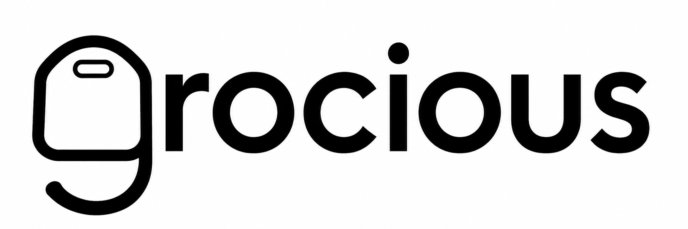

# grocious



**Your groceries. Your receipts. Your overview.**

Self-hosted tooling that pulls your Norwegian grocery loyalty data — **receipts with line
items, bonus balances and campaign offers** — straight from the chains' own APIs, keeps a
tamper-evident archive of the originals, and hands it back to you as JSON, CSV or PDF.

Built for one specific annoyance: the Trumf, Coop and Rema apps are painful or impossible
on a de-Googled Android (GrapheneOS), and none of them let you get your own purchase
history out in a form you can actually use. Runs as a handful of small containers on your
own machine. Chain fetching needs no additional cloud account. Optional AI receipt interpretation
uses the provider you configure; rules-only interpretation stays local.

## Status

| Chain | Bonus | Receipts | Line items | Offers | Notes |
|---|---|---|---|---|---|
| **Trumf / NorgesGruppen** (Kiwi, Meny, Spar, Joker, Gigaboks) | ✅ | ✅ | ✅ | ✅ | Vendor receipt images (JPEG) archived too |
| **Rema 1000** | ⚠️ | ✅ | ✅ | ✅ | Coupons only; kroner bonus was replaced by Reitan's *Spenn* points in June 2026 and is not exposed by the API |
| **Coop** | ✅ | ✅ | ✅ | ✅ | Original PDFs archived; balance needs a separate login the app API does not cover |

Offers open a detail page with provider text, terms and images when supplied. Rema activation is
**manual**; Trumf and Coop offers are read-only. Nothing is auto-activated.

## How it works

Two runtimes, on purpose:

- **`login/`** — the only part that needs a browser. Playwright drives the real login flow
  once (roughly yearly): Trumf's NextAuth → `id.trumf.no` IdentityServer (OAuth2 + PKCE,
  `offline_access`) including the SMS OTP step, Rema's passwordless SMS flow, and Coop's
  Auth0 flow with MFA. The resulting session state lands in `data/*_state.json`.
- **`app/`** — browser-free runtime. `trumf_client.py`, `rema_client.py` and the Coop
  modules read the stored session, exchange it for a bearer token and call the chains'
  own endpoints for balances, transactions and offers. This is what runs day to day;
  it needs no browser and no interaction.

The session cookie is long-lived and refreshed server-side, so re-running the login is an
exception, not a routine.

## The receipt archive

The part that matters if you care about your own records. Every purchase gets its own
folder under `data/receipts/<source>/<archive_id>/`:

- **Originals are never modified or deleted.** Files are named by their SHA-256 and
  written once; a changed original becomes a new file next to the old one.
- **`archive_id`** is a stable receipt key — SHA-256 of the chain name plus the chain's own
  receipt id — so the same purchase always resolves to the same folder. Re-running a fetch
  is idempotent.
- **`receipt.json`** holds normalised fields next to the untouched `source` payload. Unknown
  vendor fields are preserved rather than dropped, and `documents[]` lists every stored file
  with its `role`, `filename`, `sha256`, `bytes` and `mimetype`.
- Vendor-produced images are labelled as such. A PDF that grocious renders itself is a
  *derived view*, never presented as the store's original.

Archive jobs run per source (`app/provider_archive.py {rema,trumf}`, `app/coop_archive.py`),
support `--incremental` for the recent window, and can be resumed. `app/sync_provider_archives.sh`
wraps them for a scheduled run.

## HTTP API

| Endpoint | Returns |
|---|---|
| `GET /api/summary` | Dashboard data per chain plus inbox status |
| `GET /api/export/<YYYY-MM>.json` | Monthly receipts, including pending/confirmed inbox records; linked/discarded inbox records excluded. Add `?lines=1` for item lines |
| `GET /api/export/<YYYY-MM>.csv` | Same as CSV — one row per receipt, or per item with `?lines=1` |
| `GET /api/archive/<source>` | Archive index: count, `archive_id`s, `documents[]` with checksums |
| `GET /archive/<source>` | Browsable archive, independent of a live login |
| `GET /archive/<source>/<rid>` | One purchase: normalised view plus raw JSON |
| `GET /archive/<source>/<rid>.json` \| `.zip` | Full record, or every original file as a ZIP |
| `GET /archive/<source>/<rid>/file/<name>` | A single original document |

Line items are cached on disk under `GROCERY_DATA/cache/` after the first fetch (they never
change), so a second `?lines=1` export is fast.

## Web UI

The settings menu includes an optional navigation bar in the header. Add display
names and HTTP(S) URLs, edit or remove links, and toggle the bar on/off. Settings
are shared across devices and stored in `GROCERY_DATA/navigation.json`; fresh
installations have no predefined links. Links open in a new tab.

Flask, server-rendered Jinja, no CDN and no JS framework. Mobile first: receipts expand in
place and filter per chain and month, with 50 receipts per page (newest first). Offer dismissal
is remembered in this browser and can be reset with “Vis skjulte tilbud igjen”. Trumf campaign
agreement data has no images; Coop coupons exclude redeemed, expired and future entries. `app/ui.py` handles Norwegian formatting (`1 234,50 kr`,
`dd.mm.yyyy`).

**Themes** are one JSON file each in `app/themes/` — `light`, `dark`, `gruvbox`,
`zenburn`, `ink`, and all four Catppuccin flavors (`latte`, `frappe`, `macchiato`, `mocha`) ship.
These seven named palettes match Chattr; Light and Dark remain available. Drop in another file (`{"label": "…", "scheme":
"light|dark", "colors": {...}}` with keys from `themes.COLOR_KEYS`; missing keys fall back to
the base scheme) and restart, and it appears in the picker. The picker remembers the choice
in `localStorage`, «Auto» follows `prefers-color-scheme`, and `?theme=<id>` forces one.

## Receipt inbox

Upload, phone sharing, selectable receipt interpretation and optional IMAP IDLE intake: see [INBOX.md](INBOX.md). Local extraction also requires Poppler (`pdfinfo`, `pdftotext`, `pdftoppm`); the web Docker image includes it.

## Running it

```bash
cp .env.example .env
docker compose --profile login run --rm trumf-login    # once; paste the SMS code when prompted
docker compose run --rm trumf-fetch                    # pull data
docker compose up -d web                               # UI on 127.0.0.1:3012
```

Compose reads `.env` and `data/` from the project directory. To keep runtime files and
secrets outside the checkout, set `GROCIOUS_HOME=/path/to/private/runtime` in the local
`.env`; that directory then needs its own `.env` and `data/`. Export the same variable when
running `app/sync_provider_archives.sh` outside Compose.

### Configuration

| Variable | Purpose |
|---|---|
| `TRUMF_PHONE`, `TRUMF_PASSWORD` | Trumf login |
| `REMA_PHONE` | Rema login (passwordless, SMS OTP) |
| `COOP_USER`, `COOP_PASSWORD` | Coop login (Auth0 + MFA) |
| `GROCIOUS_HOME` | Private runtime directory holding `.env` and `data/` |
| `GROCERY_DATA` | Data path inside the container (default `/data`) |
| `NTFY_URL` | Optional [ntfy](https://ntfy.sh) topic for fetch summaries |
| `GROCIOUS_DEMO` | `1` serves anonymised fixtures — no tokens, no network |

## Development

```bash
python -m venv .venv
.venv/bin/pip install flask requests reportlab waitress pillow pillow-heif html2text anthropic openai jsonschema imapclient pytest ruff
GROCIOUS_DEMO=1 PORT=3012 .venv/bin/python app/webgui.py
.venv/bin/pytest && .venv/bin/ruff check .
```

Demo mode serves anonymised fixtures from `app/fixtures/` for all three chains — no
credentials, no network calls — which is also what the route tests run against. Regenerate
them with `python scripts/gen_fixtures.py`.

## Data and privacy

Your own loyalty accounts, your own machine, your own data. Secrets (`.env`) and session
state (`data/`) are `.gitignore`d and have never been committed. Tokens are stored outside
the receipt archive, and authentication headers are never archived alongside a receipt.

The chains' APIs are **unofficial and reverse-engineered**. They can change without notice,
and this is personal-use tooling for your own account — not a service, and not something to
point at anyone else's data. Watch the fetch job; when a chain changes something, it will
break there first.

## Roadmap

- [x] Trumf — bonus balance, receipts with line items, offers
- [x] Rema 1000 — receipts with line items, offers, coupon discounts
- [x] Coop — receipts with line items and original PDFs
- [x] Content-addressed original archive with checksummed documents
- [x] Web UI, themes, month export (JSON/CSV) and per-receipt download (JSON/CSV/PDF/ZIP)
- [x] Inbox — upload, share target, selectable interpretation and optional IMAP IDLE intake ([setup and acceptance checks](INBOX.md))
- [ ] Deployed phone sharing, live mail and vision-model acceptance checks
- [ ] Scheduled fetch with ntfy summary

## Credits

Reverse-engineering groundwork:
[HelgeSverre's write-up on Norwegian grocery apps](https://helgesver.re/articles/reverse-engineering-norwegian-grocery-apps)
and [his decompiled Rema API notes](https://gist.github.com/HelgeSverre/80a7f34f874336324184a0c513c2e6a2);
Trumf transaction fields from [ttyridal/trumf-data-fetch](https://github.com/ttyridal/trumf-data-fetch).
Both are unofficial descriptions — every call and response here was verified locally.

**Built by** Pål Hatlem, with [Claude](https://claude.com/claude-code) and
[Codex](https://openai.com/codex) as coding agents. Individual authorship is recorded in the
`Co-Authored-By` trailers on new agent-assisted commits; older history is preserved.

## License

[AGPL-3.0](LICENSE) — use it, self-host it, modify it; derivatives, including hosted
services, must stay open under the AGPL. No taking this private to monetise grocery data.

The wordmark uses locally hosted [Space Grotesk](https://github.com/floriankarsten/space-grotesk),
licensed under the SIL Open Font License (included in `app/static/fonts/`).
